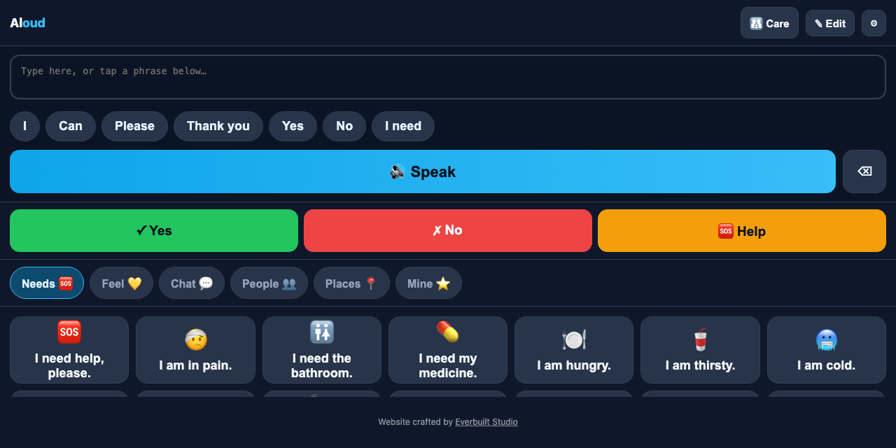

# Aloud

A free, private, offline communication app for people who cannot speak: tap a phrase or type anything and the phone says it out loud. Commercial AAC devices cost $200–300. This runs on any phone, with nothing to install and no account.

  

**Try it: https://suncal.github.io/aloud/**

## What it does

- Urgent needs on the first screen, then categories, then your own saved phrases
- Works offline after the first visit (service worker, installable PWA)
- Voice, rate and pitch settings using the phone's own speech engine; nothing is sent anywhere
- For autism, ALS, stroke recovery, laryngectomy, or anyone who needs a voice for an hour

## Run it

Open the live link on any phone and tap **Add to Home Screen**. To self-host, serve the folder over https. See `SETUP.md`.

---

**If this is useful to you, a ⭐ on the repo helps other people find it.** Issues and pull requests are welcome.

Built by [Priyankar "Sunny" Chakraborty](https://github.com/suncal) · [everbuiltstudio.com](https://everbuiltstudio.com)
